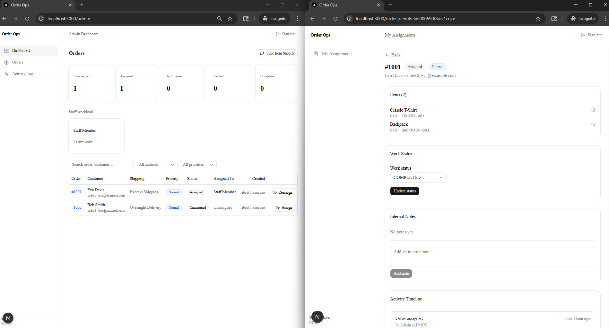
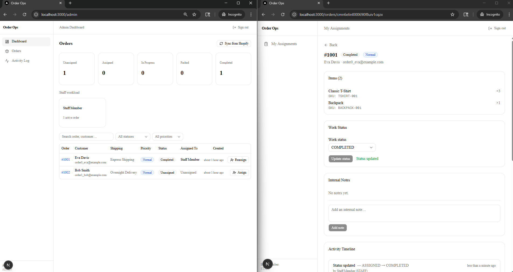

# Order Ops

A lightweight internal order assignment dashboard. Connects to a Shopify store, imports orders, and lets an admin assign them to staff for fulfillment.




## Demo credentials

| Role  | Username | Password |
|-------|----------|----------|
| Admin | `admin`  | `admin`  |
| Staff | `staff`  | `staff`  |

> Change these in your `.env` before deploying.

## Test Shopify store

| | |
|---|---|
| **Store URL** | https://expert-store-123.myshopify.com |
| **Store password** | `Test1234` |
| **Payment method** | Bogus Gateway (test) |

To place a test order, use these card details at checkout:
- Card number: `1`
- Expiry: any future date (e.g. `12/26`)
- CVV: any 3 digits (e.g. `123`)

## What it does

- Syncs orders from Shopify via the GraphQL Admin API
- Admin assigns orders to staff members
- Staff sees only their assigned queue
- Order detail shows fulfillment-critical data: items, shipping, tags, notes
- Staff updates internal work status as they progress
- All actions are recorded in a structured activity log
- Shopify webhooks keep local order data in sync in real time

## Stack

- **Next.js** (App Router, TypeScript)
- **Prisma ORM** + PostgreSQL (Supabase, Vercel Postgres, Neon, etc.)
- **Tailwind CSS** + shadcn/ui (Base UI)
- **Zod** for input validation
- **jose** for JWT session signing
- **date-fns** for date formatting

## Setup

### 1. Install dependencies

```bash
npm install
```

### 2. Configure environment variables

Copy `.env.example` to `.env.local` and fill in all values:

```bash
cp .env.example .env.local
```

Required variables:

| Variable | Description |
|---|---|
| `DATABASE_URL` | PostgreSQL connection string |
| `SESSION_SECRET` | Random 32+ char string for JWT signing |
| `ADMIN_USERNAME` | Admin login username |
| `ADMIN_PASSWORD` | Admin login password |
| `ADMIN_DISPLAY_NAME` | Admin display name |
| `STAFF_USERNAME` | Staff login username |
| `STAFF_PASSWORD` | Staff login password |
| `STAFF_DISPLAY_NAME` | Staff display name |
| `SHOPIFY_STORE_DOMAIN` | e.g. `my-store.myshopify.com` |
| `SHOPIFY_ADMIN_API_TOKEN` | Admin API token from your Shopify app |
| `SHOPIFY_API_VERSION` | Pinned version, e.g. `2024-10` |
| `SHOPIFY_WEBHOOK_SECRET` | Webhook signing secret from Shopify |

Generate a session secret:
```bash
openssl rand -base64 32
```

### 3. Set up the database

Run the Prisma migration to create all tables:

```bash
npx prisma migrate dev --name init
```

For production:

```bash
npx prisma migrate deploy
```

### 4. Run the app

```bash
npm run dev
```

Open [http://localhost:3000](http://localhost:3000). You will be redirected to `/login`.

---

## Connecting a Shopify store

1. In your Shopify admin, go to **Settings → Apps and sales channels → Develop apps**.
2. Create a new app or use an existing private/custom app.
3. Under **API credentials**, generate an **Admin API access token**.
4. Grant the following access scopes:
   - `read_orders`
   - `read_fulfillments`
5. Copy the token into `SHOPIFY_ADMIN_API_TOKEN`.
6. Set `SHOPIFY_STORE_DOMAIN` to your store's `.myshopify.com` subdomain.

---

## Initial sync

Log in as admin, then click **Sync from Shopify** on the dashboard. This fetches up to 50 of the most recent orders from Shopify and stores them locally.

---

## Webhook setup

The webhook endpoint is at:

```
POST /api/webhooks/shopify
```

### How it works

1. Shopify sends a POST request with the order payload and an HMAC signature in the `X-Shopify-Hmac-Sha256` header.
2. The endpoint reads the raw request body and verifies the HMAC using `SHOPIFY_WEBHOOK_SECRET`.
3. If verification passes, the endpoint identifies the topic from `X-Shopify-Topic` and calls `syncOrderFromShopify()` with the Shopify order GID.
4. The order is upserted locally and an `ActivityLog` entry is written.

### Registering webhooks in Shopify

In your Shopify app settings, register the following topics pointing to your deployed URL:

| Topic | Use |
|---|---|
| `orders/create` | New orders are synced immediately |
| `orders/updated` | Order edits, tags, notes are reflected locally |
| `orders/paid` | Payment status updates |
| `orders/cancelled` | Cancelled orders are updated |
| `orders/fulfilled` | Fulfillment status is synced |
| `fulfillments/create` | Fulfillment record created |
| `fulfillments/update` | Fulfillment record updated |

Set the webhook format to **JSON**.

For local development, use a tunnel like [ngrok](https://ngrok.com/) or [Cloudflare Tunnel](https://developers.cloudflare.com/cloudflare-one/connections/connect-networks/) to expose your local server.

---

## Authentication

Authentication is intentionally minimal - env-based credentials only, no external auth provider.

- `ADMIN_*` credentials: full access - sync, assign, view all orders, view activity log.
- `STAFF_*` credentials: restricted access - only assigned orders, update status, add notes.

Sessions are signed JWTs stored in an HTTP-only cookie. They expire after 24 hours.

---

## Project structure

```
app/                        Next.js App Router pages and API routes
  (dashboard)/              Protected dashboard pages
    admin/                  Admin dashboard
    staff/                  Staff assignment queue
    orders/[id]/            Order detail page
    activity/               Activity log
  api/
    auth/                   Login / logout endpoints
    webhooks/shopify/       Shopify webhook handler
components/
  auth/                     Login form
  layout/                   Sidebar, top bar
  orders/                   Orders table, assign dialog, status controls
  notes/                    Notes thread and form
  activity/                 Activity feed
lib/
  auth/                     Session JWT helpers, env credential lookup
  db/                       Prisma client singleton
  shopify/                  GraphQL client, queries, mappers, webhook verification
  services/                 Business logic: orders, assignments, notes, activity log
  actions/                  Next.js server actions
  validations/              Zod schemas
prisma/
  schema.prisma             Data model
```
